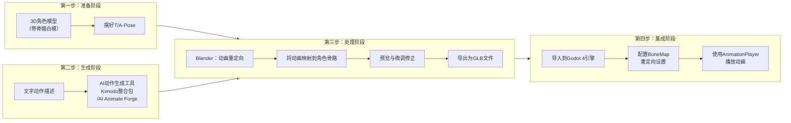

# 第 7 组

- 编号: 7
- 区间: 001-050
- 用户节点 ID: 13
- 助手节点 ID: 14
- 用户时间: 05/18/2026 11:17:51
- 助手时间: 05/18/2026 11:17:51
- 返回区间索引: [001-050.md](../../../indexes/ranges/001-050.md)
- 返回总索引: [all-turns.md](../../../indexes/all-turns.md)

## 用户

那你说一遍完整流程，从文字动作描述+3d角色资产到最终在godot的3d场景里让角色动起来。 把所需的工具，输入输出以及此时文件的格式都说清楚。

## DeepSeek

这是从一句文字描述，到在Godot场景里让一个拥有自定义骨骼的3D角色动起来的完整工作流。整个流程大致分为四个阶段：准备、生成、处理和集成。按步骤走下来，就能跑通。

---

### 🗺️ 总览路线图

在深入细节之前，我们先通过一张图来概览全局：

---

### ⚙️ 第一阶段：准备（Pre-production）

*   **所需资产**：
    *   **输入**：你自己的3D角色模型文件（如 `my_character.fbx` 或 `my_character.blend`）。
    *   **动作描述**：你想要的动作，比如“一个角色先向前行走，然后跳起来挥手”。
*   **关键操作**：在3D软件（如Blender）中打开你的角色模型，**务必确保它处于标准T-Pose或A-Pose**。这是所有后续动画重定向成功的基础。
*   **前置要求**：你的模型必须已经**完成骨骼绑定（Rigging）**，且骨骼有清晰、规范的英文命名（如 hips, spine, head）。如果骨骼命名不规范，会增加后续手动映射的工作量。

---

### 🎬 第二阶段：AI动作生成（Motion Generation）

这一步，你将把文字描述变成通用的3D动画数据。这里有两条路径，各有侧重，你可以根据自己对控制力的需求来选择。

#### **路径A：传统工作流（使用Kimodo）**

这条路径流程清晰，功能完整，让你能直接使用Kimodo的全部功能。

*   **所需工具**：NVIDIA Kimodo（通过整合包或在HuggingFace在线体验）。
*   **输入**：Kimodo的命令行或Web UI界面。
*   **操作与输出**：
    1.  **生成动画**：访问 Kimodo 的 Web UI（如 `http://127.0.0.1:7860`）[reference:0]，输入你的动作描述。
    2.  **导出文件**：Kimodo会生成一段通用骨架的动画[reference:1]，将其导出为 **`.bvh`** 或 **`.glb`** 文件[reference:2]。推荐使用 `GLB` 格式，它包含网格和动画，在Blender中的导入体验更佳[reference:3]。
    3.  **输出文件**：`kimodo_animation.glb` 或 `kimodo_animation.bvh`。

#### **路径B：高效Blender插件流（使用AI Animate Forge）**

这条路径直接在Blender内完成所有操作，无需离开Blender或手动导出/导入文件，适合追求高效率的工作流。

*   **所需工具**：Blender插件“AI Animate Forge”[reference:4]。
*   **输入**：Blender 3D视图，以及你已准备好的角色模型。
*   **操作与输出**：
    1.  **安装插件**：在Blender中安装并启用AI Animate Forge[reference:5]。
    2.  **Blender内生成**：直接在插件面板中输入你的动作描述[reference:6]。插件会自动调用Kimodo生成动画，并可以直接在你的视口中预览和选择。
    3.  **无缝衔接**：生成的动画将直接出现在Blender中，你无需管理中间文件，可以直接进入下一步的重定向流程。

#### ⚠️ 硬件门槛提示
本地使用Kimodo生成动画需要约 **17GB** 的显存（VRAM），推荐 **NVIDIA RTX 3090** 或更高规格的显卡[reference:7]。

---

### 🔧 第三阶段：动画处理（Animation Retargeting）

这个阶段在**Blender**中进行，是整个流程中实现“精准控制”的核心。目标是将通用动画“套用”（即重定向）到你自己的角色身上。

*   **所需工具**：Blender（内置BVH导入插件）[reference:8]，以及动画文件（来自第二阶段）。

*   **输入**：
    1.  你的3D角色模型文件。
    2.  AI生成的动画文件（`.glb` 或 `.bvh`）。

*   **核心操作**：
    1.  **导入动画**：在Blender中导入第二阶段生成的动画文件。
    2.  **重定向动画**：使用Blender的重定向工具，将动画源骨骼的姿势映射到你的目标角色骨骼上。`AI Animate Forge` 插件的一大优势就是它内置了集成重定向工具，可以更轻松地完成映射[reference:9]。
    3.  **预览与微调**：在时间轴上播放动画，仔细检查是否有穿模、滑步或动作不到位的问题，并使用Blender强大的动画编辑工具进行修正，这是保证动画质量的关键一步[reference:10]。
    4.  **导出最终文件**：确认无误后，将带有动画的角色模型导出为 **`GLB`** 格式[reference:11][reference:12]。

*   **关键点**：在导出前，要处理一下根骨骼的位移数据，避免角色在Godot里“原地滑步”。在Blender中，你可以通过**烘焙动画**或**清理关键帧**的方式，将根骨骼的移动数据（Root Motion）剔除或烘焙到骨骼动画中。
*   **输出文件**：`my_animated_character.glb`。

---

### 🎮 第四阶段：Godot 4 集成（Godot Integration）

最后一步，将处理好的角色和动画在Godot 4引擎中用起来。

*   **所需工具**：Godot 4.x 引擎[reference:13]。
*   **输入**：从Blender导出的 `my_animated_character.glb` 文件。

*   **操作流程**：
    1.  **导入资产**：将 `.glb` 文件直接拖入Godot的 `FileSystem` 文件系统面板[reference:14]。
    2.  **配置导入设置**：在Godot编辑器中选中你拖入的 `.glb` 文件，点击上方的 `Import`（导入）选项卡：
        *   **为角色模型**：在左侧场景树中选中你的角色根节点，在右侧检查器（Inspector）中设置一个 `BoneMap`，并选择 `SkeletonProfileHumanoid`（人形骨架预设）。这将建立一个用于重定向的骨骼映射[reference:15]。
        *   **为动画文件**：保持动画文件被选中，在 `Import` 选项卡中，将 `Import As:` 下拉框设置为 `Animation Library`，然后点击 `Reimport`（重新导入）[reference:16]。
    3.  **创建角色场景**：
        *   在 `FileSystem` 面板中，右键点击你的角色模型 `.glb` 文件，选择 `New Inherited Scene`（新建继承场景）[reference:17]。
        *   在新打开的场景中，选择根节点，然后右键点击并选择 `Clear Inheritance`（清除继承）[reference:18]。这步很关键，可以让你自由编辑节点。
        *   将根节点类型改为 `CharacterBody3D`[reference:19]。
    4.  **加载与播放动画**：
        *   在场景中选中 `AnimationPlayer` 节点，在底部动画面板中，点击 `Animation` -> `Manage Animations...`（管理动画）[reference:20]。
        *   在弹出的窗口中，点击 `Load Library`（加载库），然后选择你之前导入的 `Animation Library` 文件[reference:21][reference:22]。这样一来，你的`AnimationPlayer`就能使用这些动画了。之后你还可以添加`AnimationTree`节点，用状态机或混合树来管理复杂的动画逻辑[reference:23]。

---

### 💎 总结

整个工作流可以概括为：**准备 → 生成 → 处理 → 集成**。

1.  **准备**：确保你的角色模型（**格式：FBX/Blend**）处于T-Pose/A-Pose。
2.  **生成**：用Kimodo（整合包或**AI Animate Forge**）将文字描述变成通用动画（**输出格式：BVH/GLB**）。
3.  **处理**：在Blender中将动画重定向并微调到你的角色上，然后导出（**输出格式：GLB**）。
4.  **集成**：在Godot 4中导入GLB，配置好BoneMap和AnimationLibrary，角色就能动起来了。

你打算走哪条路？是用 Kimodo 直接导出 BVH，还是在 Blender 里用插件一步到位？我可以针对你选的路，再给你拆一拆具体的操作细节。
