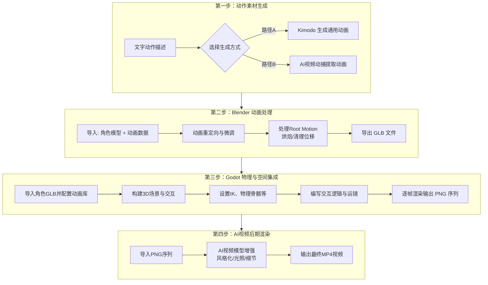

# 第 11 组

- 编号: 11
- 区间: 001-050
- 用户节点 ID: 21
- 助手节点 ID: 22
- 用户时间: 05/18/2026 11:35:51
- 助手时间: 05/18/2026 11:35:51
- 返回区间索引: [001-050.md](../../../indexes/ranges/001-050.md)
- 返回总索引: [all-turns.md](../../../indexes/all-turns.md)

## 用户

那你再搞一遍完整流程吧

## DeepSeek

这次我们整合之前所有的讨论，构建一个**从一句文字描述，到在Godot中实现物理和空间交互，并最终由AI视频模型完成高质量渲染**的完整工作流。

这套流程将AI的创意生成、Blender的动画精修、Godot的物理与空间控制，以及AI视频的视觉增强，环环相扣地衔接起来。

---

### 🗺️ 全局管线概览

---

### ⚙️ 第一步：动作素材生成

**目标**：将一句文字描述，转化为通用的骨骼动画数据（BVH或GLB）。

**输入**：你想要的任何动作描述，例如“角色先向前行走，然后跳起来挥手”。

**路径选择**：

| 路径 | 工具 | 操作 | 输出 | 特点 |
| :--- | :--- | :--- | :--- | :--- |
| **A: AI直接生成** | NVIDIA Kimodo （本地整合包或Web UI） | 在命令行或网页界面输入文字，生成动画，导出为文件。 | `animation.bvh` 或 `animation.glb` | 功能最完整，支持关键帧约束，控制力强。 |
| **B: 视频转动画** | AI视频生成模型 + 视频动捕工具 （如iClone Video Mocap） | 先用Sora等生成动作视频，或用手机拍摄真人表演，再导入动捕工具提取骨骼动画。 | `animation.bvh` 或 `animation.fbx` | 适合复刻真人细腻表演或实现奇幻动作。 |

**硬件提示**：本地运行Kimodo需要约17GB显存，建议使用RTX 3090及以上显卡。

---

### 🔧 第二步：Blender 动画处理

**目标**：将通用骨骼动画数据，精准地“套用”到你自己的角色模型上，并处理掉所有可能引发后续问题的数据。

**输入**：
*   你的3D角色模型文件（`.blend` 或 `.fbx`），需保证其处于**标准T-Pose或A-Pose**，且已完成骨骼绑定。
*   第一步生成的动画文件（`.bvh` 或 `.glb`）。

**关键操作**：
1.  **导入与重定向**：在Blender中导入动画，使用重定向工具将动画源骨骼的动画映射到你的目标角色骨骼上。推荐使用**AI Animate Forge**插件，它可以简化这一步，甚至直接从Blender内生成动画并自动重定向。
2.  **预览与微调**：逐帧检查动画，修正穿模、滑步或不自然的姿态。这是保证动画品质的核心环节。
3.  **处理Root Motion**：这是为Godot的物理集成做的重要准备。你需要通过烘焙或清理关键帧的方式，将根骨骼的水平位移数据剔除，避免角色在Godot中“原地滑步”。
4.  **导出**：将处理好的角色和动画，导出为一个包含网格、骨骼和动画的单一文件。
    *   **输出格式**：**`my_animated_character.glb`** (glTF 2.0 二进制格式)。

---

### 🎮 第三步：Godot 物理与空间交互集成

**目标**：在Godot中，让角色在真实物理规则下，与环境和其他物体进行精准、有逻辑的交互，并完成整个3D场景的“拍摄”。

**输入**：`my_animated_character.glb`

**核心环节与实现技术**：

1.  **资产导入与配置**
    *   将`.glb`文件拖入Godot文件系统。
    *   为角色模型配置`BoneMap`和`SkeletonProfileHumanoid`，将导入的动画设置为`AnimationLibrary`。

2.  **构建物理与空间交互体系**
    *   **逆向运动学**：为角色添加`SkeletonIK3D`节点（或使用GodotIK插件）。通过`AnimationTree`动态控制IK影响系数，让角色的手可以**精准触碰**到场景中任意位置的物体（如水杯、门把手）。
    *   **物理响应**：为角色的部分骨骼（如头发、披风，或用于布娃娃死亡效果）创建`PhysicalBone3D`。这样，当角色被击中或死亡时，这些骨骼会受重力、碰撞影响，产生真实的物理反应。
    *   **空间感知**：利用`RayCast3D`进行环境探测，结合IK让角色双脚自动贴合不平坦的地形，或让视线跟随目标移动。

3.  **场景搭建与“拍摄”**
    *   在Godot中像搭积木一样放置场景模型、灯光、粒子特效。
    *   创建`Camera3D`节点，用`AnimationPlayer`为摄像机制作**关键帧动画**，实现专业的推拉摇移等镜头运动，完美利用3D空间的透视准确性。

4.  **输出高质量渲染序列**
    *   编写GDScript脚本，通过`get_viewport().get_texture().get_data()`逐帧渲染画面。
    *   **输出格式**：将每一帧保存为无损的 **`frame_0000.png`** 序列文件。这样你就能得到空间精准、物理完美的高质量源素材。

---

### 🎬 第四步：AI视频后期渲染 (可选增强)

**目标**：利用AI视频模型的风格化与生成能力，为Godot输出的精准空间画面，添加风格化的视觉效果或提升画质，解决单纯游戏引擎渲染在美学质感上的不足。

**输入**：第三步输出的 PNG 序列。

**工作流**：
1.  **预合成**：将PNG序列导入Blender或After Effects，合成为一段基础视频。这一步可以同时输出**深度图、法线图**等辅助通道。
2.  **AI风格化渲染**：将基础视频及辅助通道送入AI视频模型（如Stable Video Diffusion的图生视频模式，或商业工具如Runway Gen-3）。
3.  **控制与生成**：利用ControlNet等机制，**用原始精准的空间结构（如法线图、深度图）死死约束AI的生成范围**，确保AI的渲染不会破坏Godot输出的正确透视和物体边界。只需给出风格参考，就能生成出具有油画、赛博朋克等艺术风格，且空间关系完美的最终画面。
4.  **输出**：导出最终的高质量 **MP4 视频**。

---

### 💎 总结：为什么这是终极方案？

| 环节 | 解决问题 | 核心技术 |
| :--- | :--- | :--- |
| **Kimodo / 视频动捕** | 用AI高效生成自然、复杂的角色动作。 | 扩散模型 / 视频动捕 |
| **Blender** | 将AI动作完美适配到自定义角色。 | 动画重定向 |
| **Godot** | 提供**100%精准的空间与物理交互**，和自由的镜头控制。 | IK, PhysicalBone, RayCast, 3D Rendering |
| **AI视频后期** | 在**保留完美空间结构**的基础上，赋予画面高级的艺术风格和质感。 | ControlNet + 视频生成模型 |

这条管线让你既能享受到AI在创意和美学上的强大，又牢牢掌握住了空间和物理的确定性。如果你决定亲手实践，我可以为你提供Godot中设置IK或物理骨骼的具体步骤和代码示例。
