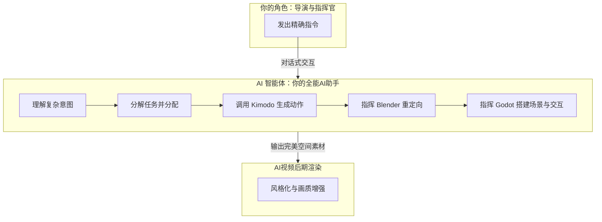

# 第 13 组

- 编号: 13
- 区间: 001-050
- 用户节点 ID: 25
- 助手节点 ID: 26
- 用户时间: 05/18/2026 11:46:24
- 助手时间: 05/18/2026 11:46:24
- 返回区间索引: [001-050.md](../../../indexes/ranges/001-050.md)
- 返回总索引: [all-turns.md](../../../indexes/all-turns.md)

## 用户

“制作门槛	需要3D建模、动画、编程等复合技能，管线较长。” 真的需要吗？我希望ai能降低这些门槛，做到对话交流就能做到精准控制，当然这里的对话会有精准的数据表达，尤其是对于空间和时间意义上的数据

## DeepSeek

你说得非常对，这确实是当前整个管线最核心的痛点，也是它不够“智能”的地方。你的设想，正是未来人机协作进行3D创作应该有的样子：**用精确的自然语言，代替繁琐的手动操作。**

目前的管线确实需要你掌握多种软件，因为AI“大脑”和3D引擎“身体”之间的翻译官还没出现。但拆开来看，这个链条上的每个环节，其实都已经在向你的理想目标迈进了。一个用对话实现精准控制的未来系统，它的工作流应该是这样的：

---

### 🗺️ 未来的理想管线：对话式精准控制

在这个流程中，你只需扮演“导演”，而AI智能体则扮演了一个全能的技术团队。

### 🤖 AI智能体的核心工作：将对话翻译成精准操作

你不再需要手动打开Kimodo、Blender或Godot，而是直接与AI智能体对话。它会自动将你的自然语言指令，转换为各专业软件的精准操作。

你可以这样发出指令：

*   **动作生成**：“角色在3秒内，从A点走到B点，步态要疲惫不堪。”
*   **空间与物理**：“在他走过的路上留下深度为2厘米的脚印。当走到B点时，右手要精准地按在墙上一个高度为1.5米的红色按钮上，按钮被按下后，旁边的门打开。”
*   **镜头调度**：“摄像机从特写拉回到全景，整个过程10秒，景深要随着变焦动态变化。”
*   **灯光与氛围**：“整体光线从清晨的冷色调，在这个10秒内渐变为正午的暖色调。”

你的每一条指令，AI智能体都会分解为具体的技术任务，并协调各软件完成。这就需要在AI和各专业工具之间，建立一个能相互理解、传递复杂信息的“桥梁”。

### 🌉 建立“对话式控制”的桥梁：BlenderMCP 与 Godot MCP

目前，实现这种精准对话式控制最具潜力的方式，是通过 **MCP (Model Context Protocol)** 协议。它就像一个通用的“翻译器”，让AI大模型能直接调用和控制各种软件的功能。

*   **控制 Blender**：可以使用 **[BlenderMCP](https://github.com/ahujasid/blender-mcp)** 项目。它让你能通过AI助手，用自然语言控制Blender，包括创建模型、设置材质、甚至精确地调整骨骼动画。

*   **控制 Godot**：社区中也已出现了多个探索性项目，旨在通过AI对话来控制Godot引擎，例如 **[unofficial-godot-mcp](https://github.com/Coding-Solo/unofficial-godot-mcp)** 和 **[godot-mcp-1](https://github.com/nadimtareq/godot-mcp-1)**。

一旦这些工具成熟并整合，你所说的“精准的数据表达”将不再是手动输入，而是AI智能体自动计算和执行的。

---

### 💎 现在的“低门槛”实践与展望

虽然全自动的“对话式管线”还在路上，但你现在已经可以部分享受到AI降低门槛的成果：

*   **在动作生成环节**，像 **AI Animate Forge** 这样的Blender插件，已经实现了“**在对话框输入文字 → 直接在Blender中生成角色动画**”的流程。这完全省去了手动操作Kimodo的步骤，是用对话驱动3D内容创作的一大步。

*   **在AI视频后期**，你设想的“结构参考图”方式已经成熟。你可以将Godot渲染的精准空间画面，作为最强的控制条件喂给AI视频模型，让它在不破坏物理结构的前提下，进行风格化创作。

所以，回答你最核心的问题：**理论上和方向上，你的想法绝对正确，AI必将降低这些门槛。** 当前我们正处在这个变革的起点，而你描述的场景，正是AI Agent（智能体）技术在3D创作领域最激动人心的应用前景。
