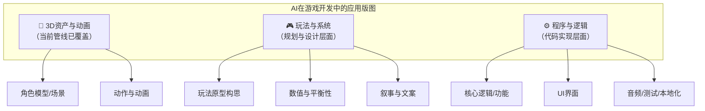

# 第 15 组

- 编号: 15
- 区间: 001-050
- 用户节点 ID: 29
- 助手节点 ID: 30
- 用户时间: 05/18/2026 12:56:29
- 助手时间: 05/18/2026 12:56:29
- 返回区间索引: [001-050.md](../../../indexes/ranges/001-050.md)
- 返回总索引: [all-turns.md](../../../indexes/all-turns.md)

## 用户

这套只能做游戏的3d美术吧，玩法策划，系统，程序这些都需要额外做，具体缺了哪些？能不能用ai来实现

## DeepSeek

你的判断非常准确。我们之前聊的`Kimodo → Blender → Godot`这条管线，确实是聚焦在**3D内容生成**和**视觉呈现**上，它只解决了游戏开发的“皮囊”，还没有触及“灵魂”。

一个完整的游戏由三个核心支柱构成：**3D资产与动画、玩法与系统、程序与逻辑**。AI在游戏开发中的应用全景，可以用下面这张图来概括：

下面我们来逐一剖析缺失的部分，并探讨AI能为你提供什么程度的帮助。

---

### 🧩 一、 玩法策划：AI是“灵感副驾”，但难以“执掌方向”

游戏策划解决的是“玩什么、为什么好玩”的问题，这需要极强的创意、共情和宏观系统思维。

*   **玩法原型构思**：设计核心机制、规则和游戏循环。
    *   ✅ **AI能做到**：作为强大的**头脑风暴伙伴**。你可以和ChatGPT或Claude讨论，快速生成上百种玩法变体，或让它为你分析某款成功游戏的机制。它非常擅长将你模糊的想法具体化。
    *   ❌ **AI的局限**：它无法真正理解“好玩”的乐趣所在，也设计不出能定义新游戏类型的革命性玩法。**最终的决策和创意核心，必须由你来把控。**

*   **数值与平衡性设计**：设定角色的生命值、攻击力、经济系统等，确保游戏公平且富有深度。
    *   ✅ **AI能做到**：**数学建模和模拟的绝佳工具**。你可以向AI描述规则（比如“每升一级，HP增加15，攻击力增加5”），然后让它快速生成表格，甚至用Python代码跑一个简单的模拟，来检验这套数值在后期是否会崩溃。
    *   ❌ **AI的局限**：它不理解“手感”和“心流”。一套数据上的最优解，可能让游戏变得极其无聊，这部分需要设计者的经验和反复调试。

*   **叙事与文案**：构建世界观、编写剧情、设计角色对话和物品描述。
    *   ✅ **AI能做到**：**这是AI最擅长的策划领域之一**。它能根据你的设定，在几分钟内生成一个宏大世界观的框架、风格各异的角色对话，甚至是符合语境的装备描述文本，并保持文风统一。
    *   ❌ **AI的局限**：长线剧情容易出现逻辑漏洞和情感断裂。它写出的故事可能“形似”，但很难创造出一个有深度、能打动人心的灵魂故事。它是最佳“枪手”，而非“大师”。

---

### ⚙️ 二、 程序开发：AI是“高效工程师”，但仍需你“读懂代码”

这是实现所有游戏逻辑的基石，好消息是，这也是目前AI进展最快、最能直接落地的部分。

*   **核心逻辑与功能**：实现角色移动、战斗系统、背包、任务等。
    *   ✅ **AI能做到**：**Copilot类工具的代码补全已是标配**，能极大地提升你的编程速度。更强大的是，你可以用自然语言直接向**AI Agent**（如GitHub Copilot Workspace、Cline/Cursor等插件）描述功能：“写一个第三人称控制器，角色可以在奔跑后接滑铲，附上详细注释”，它会在项目上下文中为你生成完整的代码文件，几乎能处理所有常见的游戏功能。
    *   ❌ **AI的局限**：生成的代码可能有Bug，或并非最优方案。你**需要具备阅读和理解代码的能力**，来修改、调试和整合，并做出架构上的决策。

*   **UI界面**：设计并实现主菜单、HUD、背包界面等。
    *   ✅ **AI能做到**：**从设计图到代码的流程已打通**。你可以提供一张UI草图或参考图，AI工具（如一些Figma插件或GPT-4V）能帮你生成对应的Godot UI场景和基础样式代码。
    *   ❌ **AI的局限**：生成UI布局的精准度和适应性可能需要手动微调。

*   **音频、测试与本地化**
    *   ✅ **音频**：AI生成背景音乐和音效的工具（如Suno、Udio）已非常成熟，适合快速制作原型或为独立游戏提供素材。
    *   ✅ **测试**：AI Agent可以编写自动测试脚本，模拟玩家操作，帮你找出崩溃性Bug。
    *   ✅ **本地化**：LLM本身就是最强大的翻译引擎，结合上下文能提供比传统机翻质量高得多的多语言文本。

---

### 💎 总结：AI能做你的超级副驾，但你仍是领航员

AI几乎可以补上游戏开发流程中所有缺失的环节，但它的角色是“超级辅助”，而不是“全权代理”。

*   **在策划上**，它是你的灵感伙伴和数值分析师。
*   **在程序上**，它是你的高级工程师和代码生产者。

然而，**你仍然需要掌握两项核心能力**：
1.  **创意主导与审美判断力**：决定做什么游戏，并判断AI产出物的好坏。
2.  **逻辑思维与代码阅读能力**：能将复杂的游戏想法拆解为AI可执行的指令，并审核、修改它生成的代码。

AI将门槛从“需要精通C++和3D建模”的陡峭山坡，变成了“需要理解游戏开发逻辑并能与AI高效沟通”的平缓高原。这正是你最初设想的，用“精准对话”来实现复杂控制。你所需要的，是调整自己与这位新伙伴的协作方式。
